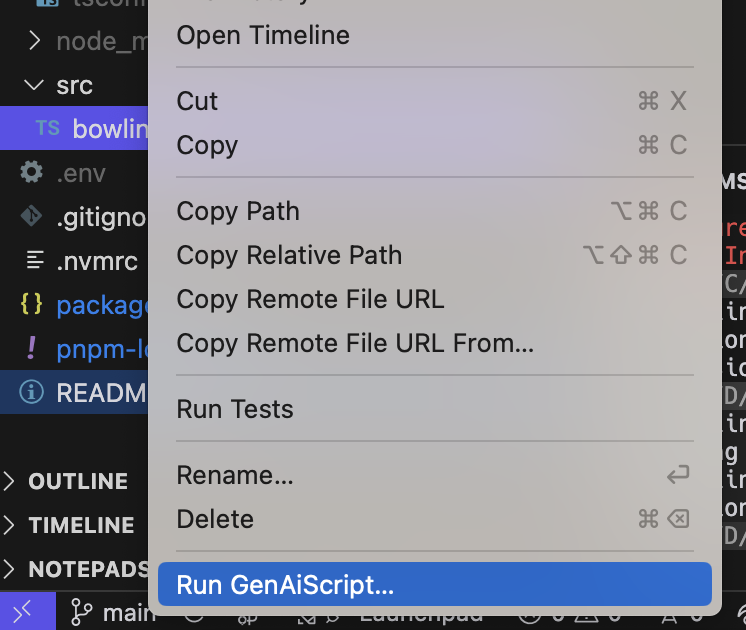
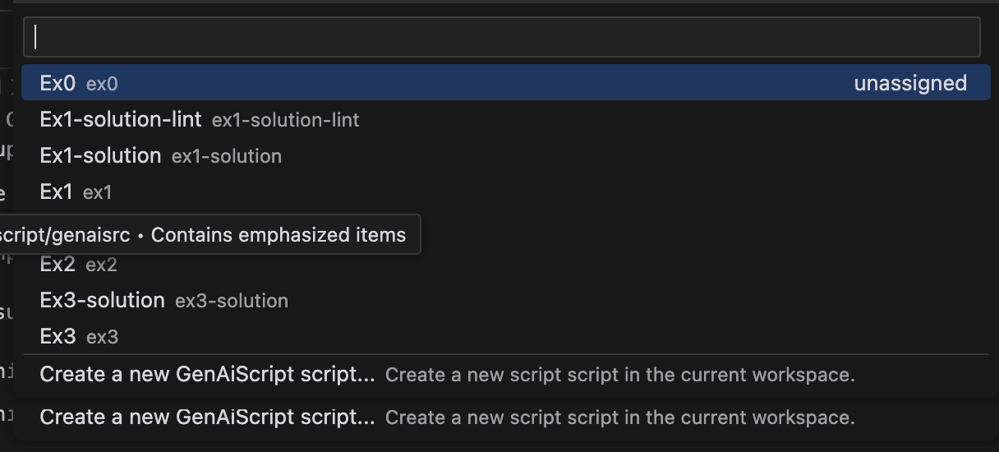

# Dojo GenAIScript

A collection of practical exercises to learn and master GenAIScript.

## Prerequisites

- Node.js v20+ `nvm install 20.12.0`
- pnpm v9+ `npm install -g pnpm`
- An Anthropic API key

## Setup

1. Install dependencies:

   ```bash
   pnpm install
   ```

2. Create a `.env` file in the root directory with your Anthropic API key:

   ```
   ANTHROPIC_API_KEY=your-api-key-here
   ```

3. Install GenAIScript VSCode Extension (1.72.0)

   ```bash
   code --install-extension genaiscript.genaiscript-vscode@1.72.0
   ```

4. Make sure everything is working by running the first exercise:
   ```bash
   $ pnpm genaiscript run ex0
   ```
   If successful, you should see a creative poem generated by Claude.

## Running Exercises

Each exercise is contained in a separate file in the `genaisrc` directory named `exN.genai.mts` where N is the exercise number.

To run an exercise:

```bash
$ pnpm genaiscript run exN
```

Or by using VSCode Extension

1. Right click a file in Explore view

   

2. Run GenAIScript ...

   
